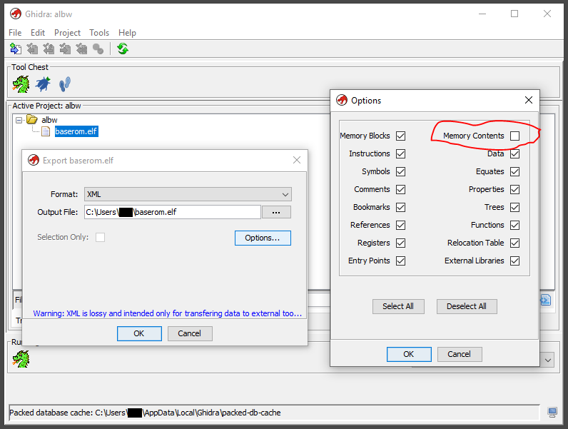

# albw-decomp
Decomposition of A Link Between Worlds

# Importing

<u>Note</u>: You must supply your own `baserom.elf`.

Instructions:
1. Remove any existing work/analysis on the ELF file. To update, we will need an unaltered version of `baserom.elf`.
2. Goto `File` -> `Import File...` and import a fresh copy of your `baserom.elf`
3. Open `baserom.elf` in the CodeBrowser
4. Goto `File` -> `Add to Program...`
5. Select the `baserom.elf.xml` as provided from this repository and click `Add to Program`.

# Exporting

Instructions:
1. Right Click `baserom.elf` and choose `Export` from the Active Project window
2. Choose `XML` as the Format
3. Click `Options`:
   - Deselect `Memory Contents` so that the code binaries are NOT included.
4. Click `OK`
5. To submit changes, create a new branch off `master` and open a Pull Request for review.

